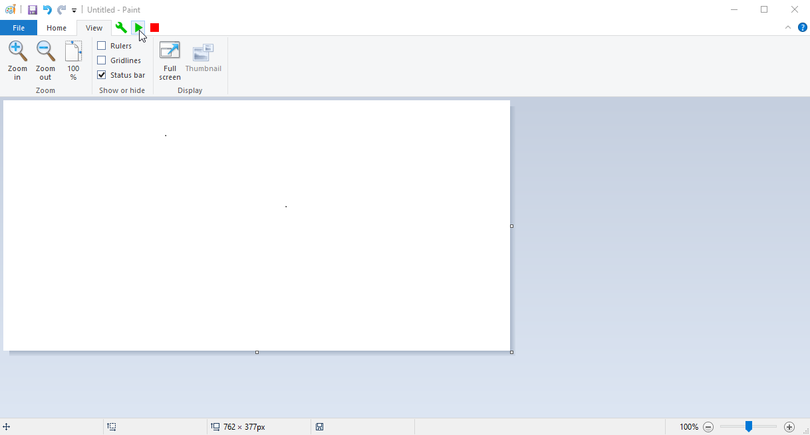

# Paint Injector

 

Note: I haven't ever worked with C# before this, so this is basically trial and error, and lots of googling. If this isn't at the same sub-par level of coding standards as the main MS Paint IDE project, that's expected.

Paint Injector is a project for [MS Paint IDE](https://github.com/RubbaBoy/MSPaintIDE) that adds buttons to the actual MS Paint program to interact with the IDE. It uses a [fork](https://github.com/RubbaBoy/OpenTitlebarButtons) of [OpenTitlebarButtons](https://github.com/NickAcPT/OpenTitlebarButtons), which is a library to add extra buttons to the title bar of windows.

Very early alpha screenshot of what this does currently (No modification to MS Paint):

